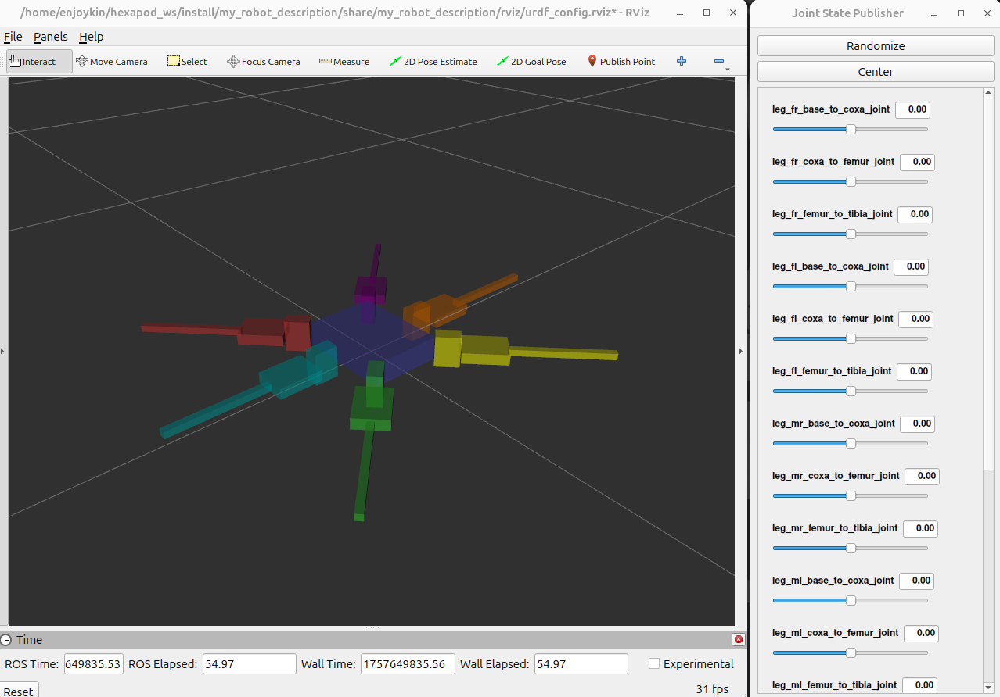

# Hexapod Robot Description (ROS2)

A ROS2-based hexapod robot project focusing on learning and implementing various robotics technologies. The system is designed for battery-powered operation, utilizing a Raspberry Pi 4 as the main computing unit and a Servo2040 board for precise servo control.



## Project Goals

### Phase 1 (Current)
- Basic hexapod walking implementation
- Manual control system
- ROS2 integration
- RViz and Gazebo simulation

### Future Plans
- Remote control implementation:
  - PS4 controller support
  - Smartphone control interface
- Sensor integration:
  - LIDAR
  - Camera
- Object detection and tracking

## Used System

- Ubuntu 24.04.2 LTS (Noble Numbat)
- ROS2 Jazzy
- Gazebo Harmonic (gz-sim 8.9.0)
- RViz2 (14.1.7)

## Quick Start

```bash
# Build
colcon build

# Source
source install/setup.bash

# Launch visualization (Rviz)
ros2 launch my_robot_description display.launch.xml

# Launch Gazebo & Rviz
ros2 launch my_robot_bringup my_robot_gazebo.launch.xml
```

## Acknowledgments

3D models (STL files) are based on the [Hexapod Spiderbot Model](https://github.com/robs-tech-workbench/hexapod_spiderbot_model) project.

## License

This project is licensed under the MIT License - see the [LICENSE](LICENSE) file for details.