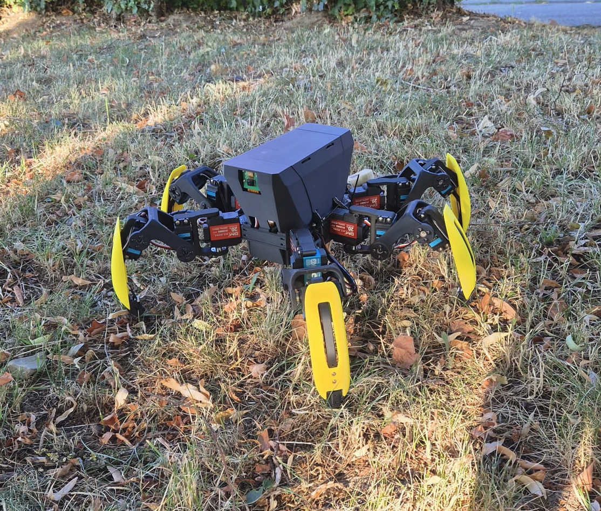
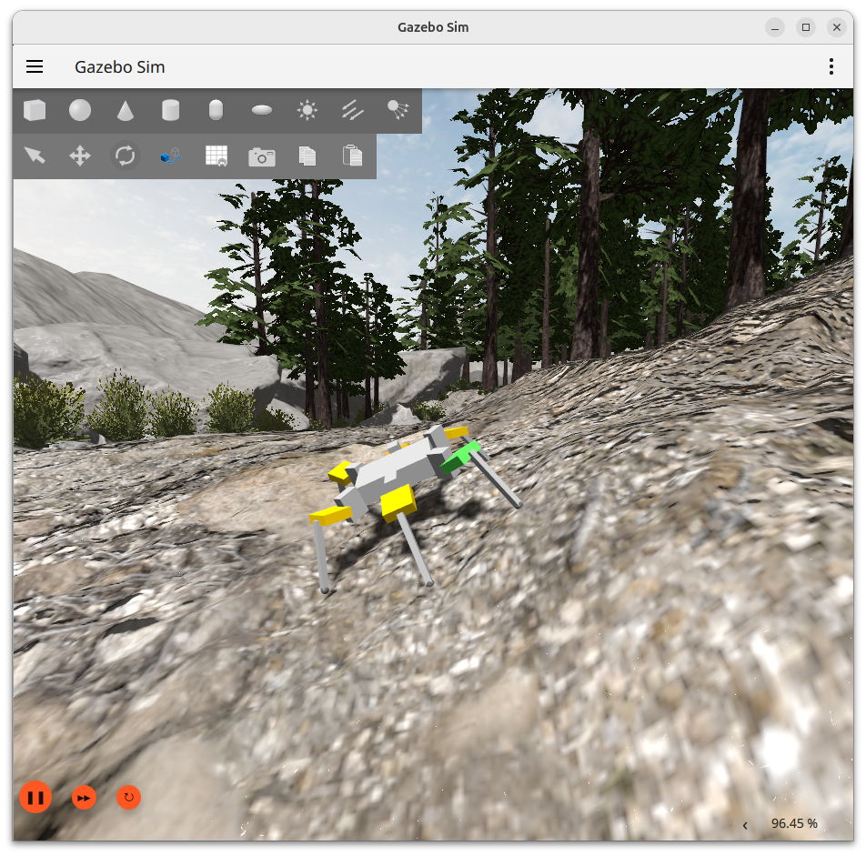
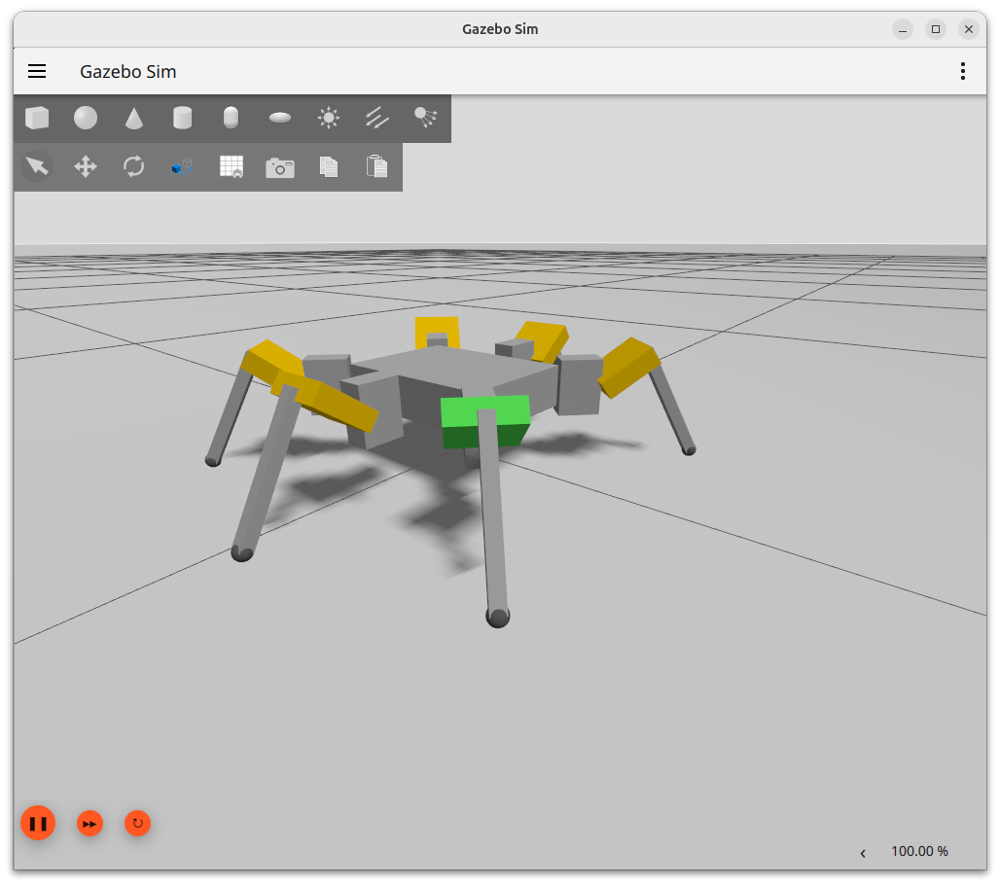
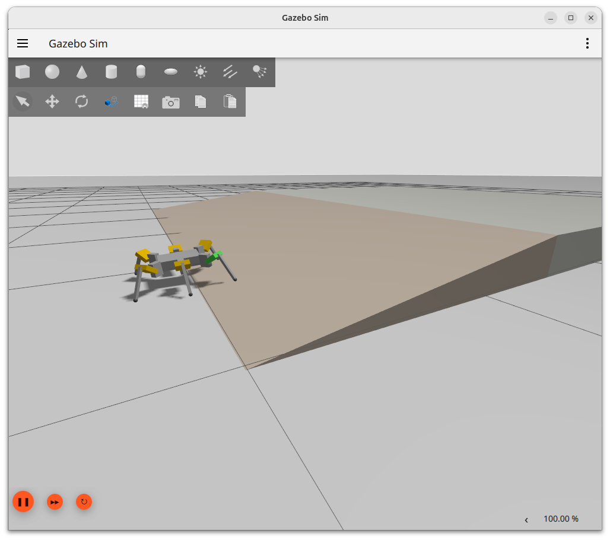
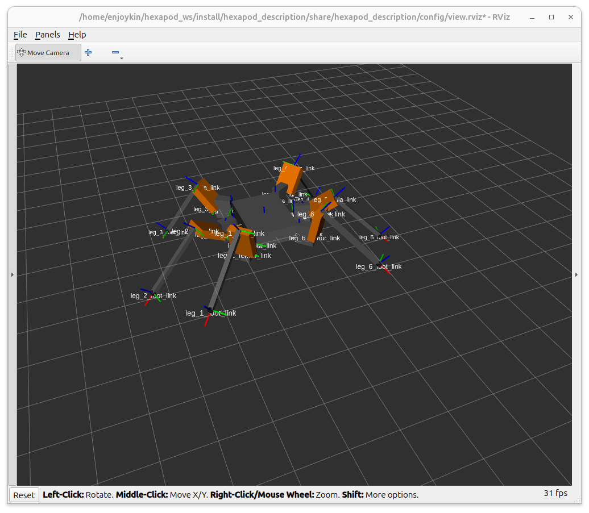
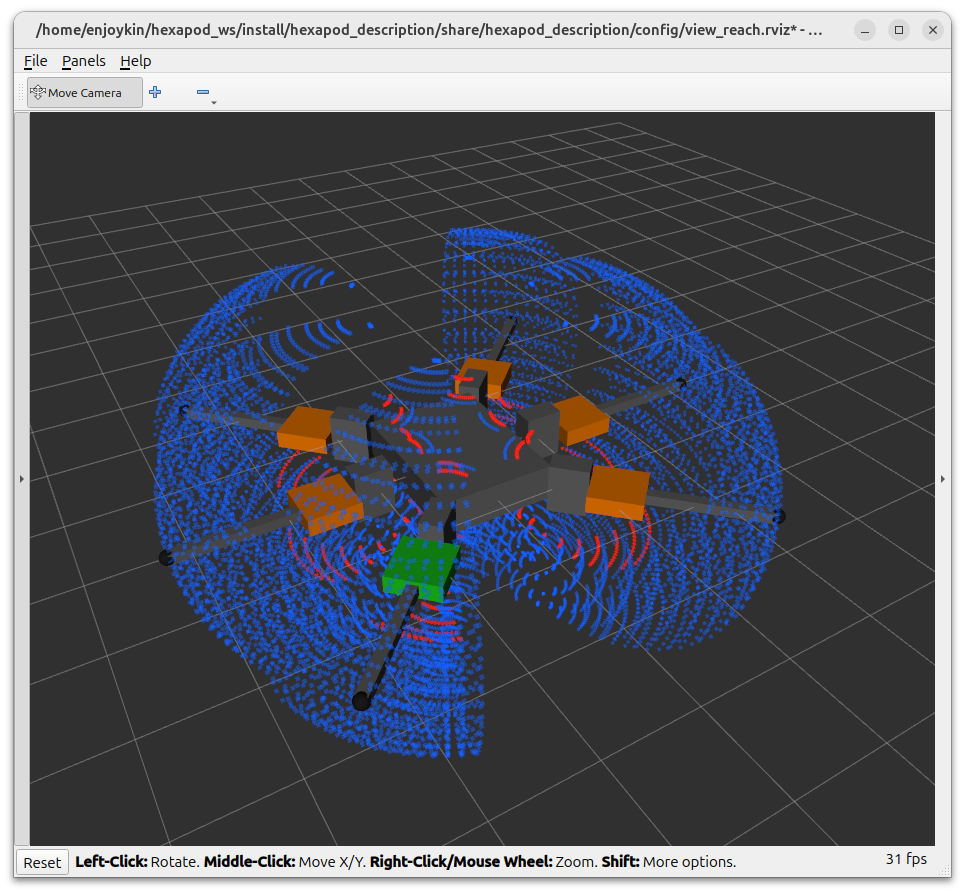

# Hexapod

A six-legged walking robot (18 servos) — built in **ROS 2 Jazzy** + **Gazebo Harmonic** and
running **1:1 on real hardware** (Servo2040 + Raspberry Pi 5) via `ros2_control`. Omnidirectional
walking, multiple gaits, validated stance & speed presets, IMU-based body leveling and tip-over
protection, foot-contact terrain adaptation, sit/stand sequences, free-leg "show" poses,
PS4 control (USB + Bluetooth), and a **mobile app** (phone + Razer Kishi) with live video,
status overlay and on-screen configuration.

<p align="center">
  
</p>
<p align="center"><sub>The real robot — 18 servos, Raspberry Pi 5 + Servo2040, foot switches, BNO-055 IMU</sub></p>

<p align="center">
  
</p>
<p align="center"><sub>Rough-terrain simulation — terrain model "Rubicon" © Open Robotics, <a href="https://creativecommons.org/licenses/by/4.0/">CC BY 4.0</a>, via Gazebo Fuel</sub></p>

<p align="center">
  
  &nbsp;
  
  &nbsp;
  
  &nbsp;
  
</p>
<p align="center"><sub>Gazebo simulation &nbsp;·&nbsp; ramp world (slope walking) &nbsp;·&nbsp; RViz (model + TF) &nbsp;·&nbsp; per-leg reachability visualization</sub></p>

<!-- TODO: add a YouTube demo as a clickable thumbnail (GitHub can't embed a player):
     [](https://youtu.be/YOUR_VIDEO_ID) -->
> 🎥 _Video demo coming soon._

---

**Contents:** [Features](#features) · [Hardware](#hardware-target-platform) · [Software](#software-requirements) · [Quickstart](#quickstart-simulation) · [Controls](#controls-ps4-dualshock-4) · [Mobile app](#mobile-app-phone--kishi) · [Packages](#packages) · [Tools](#tools-tools) · [Documentation](#documentation) · [Status](#status)

---

## Features

- **Omnidirectional walking** via `/cmd_vel` — forward/back, strafe, turn, arcs (analog, proportional).
- **4 gaits**, switchable on the fly: tripod, wave, tetrapod, ripple.
- **3 validated stance modes** (low/mid/high body height), switchable while standing (coupled
  reposition + height lerp). Each mode couples an offline-validated **step height** and
  **max step length** — values above the per-mode cap are rejected (keeps every combination
  inside the leg envelope instead of freezing on hardware).
- **4 speed presets** (slow / mid / fast / aggressive) on the D-pad — gait cycle time +
  stick scaling, envelope-neutral by design.
- **IMU balance (BNO-055):** body leveling with per-axis PI-D control, terrain following
  (pitch follows the slope, roll levels to zero) and tip-over detection → safety freeze —
  **verified on the real robot**.
- **Foot-contact terrain adaptation** (6 foot switches on hardware, Gazebo contacts in sim):
  per-foot adaptive touchdown and adaptive stand on uneven ground, slip/edge detection →
  safety freeze, sensor-fault masking (degrade, don't stop).
- **Sit / stand / shutdown** as clean sequences (graceful power-off, comms-loss fail-safe).
- **Emergency stop & one-click recovery:** a latched software **E-stop** (from the app, works in sim
  and on hardware) freezes the robot in place; one **recovery** ramps it — cause-agnostic,
  joint-space, no IK — from the frozen pose back to a stand, without restarting the stack.
- **On-board audio:** the robot plays short mp3s through its own speaker (MAX98357A) — **movement
  sounds** (stand-up / sit-down / height-change / freeze, triggered by the gait sequence logic) plus
  a **soundboard** the app can fire; auto-sounds mutable via a `sound_enable` param.
- **Free-leg "show" pose:** support on 4 legs, 2 front legs steered freely by joystick (incl. tibia reach).
- **PS4 teleop:** USB **and** Bluetooth — omnidirectional sticks, dead-man, intent services.
- **Mobile app (phone + Razer Kishi):** drives the robot over rosbridge (Wi-Fi) — full-screen
  **video**, live **status overlay** (state / stance / gait / speed / foot contacts / tip warning),
  an **rqt-style config panel** (tunable parameters, live), and full **lifecycle** (start / stand /
  walk / sit / stop the whole stack from the phone). Simulation today; the same seam drives the Pi.
  See [Mobile app](#mobile-app-phone--kishi).
- **Sim ↔ hardware identical — proven:** the same high-level code runs in Gazebo and on the
  real servos (`ros2_control` abstraction, plugin chosen by a launch argument); the full
  locomotion stack has been walking on the physical robot.
- **Pure-Python closed-form IK/FK** (testable without ROS) + offline validation tools
  (reach / joint margins / CoG / torque, incl. a transition-coverage engine check).

## Hardware (target platform)

| Component | Choice |
|---|---|
| Servo controller | Pimoroni **Servo2040** (USB-CDC), custom firmware ([repo](https://github.com/enjoykin-ua/hexapod_servo_driver)) |
| Coxa servos (6×) | Diymore **8120MG**, ~20 kg·cm, 270°, 4.8–8.4 V |
| Femur/Tibia servos (12×) | Miuzei **MS61**, ~35 kg·cm, 270°, 4.8–8.4 V |
| Compute | Raspberry **Pi 5** (8 GB), Ubuntu Server 24.04 arm64 (headless) |
| Power | 2S **LiPo** (7.4 V nom.) → [Power Supply HAT for Pi 5](https://www.electrokit.com/en/stromforsorjningskort-for-raspberry-pi-6-32vin-5a) (electrokit, 6–32 V in, 5 A) powers the Pi 5; the same battery also feeds the **Servo2040** (servo rail) |
| Power cutoff | **Relay Module DC 5 V 1-channel with optocoupler** — gates the servo rail (graceful power-on/off, software-controlled) |
| Input | PS4 **DualShock 4** (USB or Bluetooth) |

> The Servo2040 **firmware** lives in a separate repo:
> [`hexapod_servo_driver`](https://github.com/enjoykin-ua/hexapod_servo_driver)
> (wire protocol: [PROTOCOL.md](https://github.com/enjoykin-ua/hexapod_servo_driver/blob/main/PROTOCOL.md)).

## Software requirements

- **Ubuntu 24.04 LTS** (desktop for sim/dev, Pi Server arm64 for hardware)
- **ROS 2 Jazzy Jalisco**
- **Gazebo Harmonic** — exclusively via `ros-jazzy-ros-gz` (no second Gazebo package source)
- `ros2_control` + `gz_ros2_control`, `rviz2`, `rqt_reconfigure`
- Python 3.12 (rclpy) · C++ (hardware interface, pluginlib)

## Quickstart (simulation)

```bash
cd ~/hexapod_ws
colcon build --symlink-install
source install/setup.bash
```

### Run it — two ways

**A) Mobile app — one command.** Start the always-on layer; the
[mobile app](#mobile-app-phone--kishi) then connects over Wi-Fi and runs the robot from the phone
(connect → **Start** → **Stand up** → drive). The command below is the **only** thing you launch on
the desktop — the app starts / stops the heavy stack itself:
```bash
ros2 launch hexapod_bringup always_on.launch.py                 # flat world
ros2 launch hexapod_bringup always_on.launch.py scene:=rubicon  # rough terrain + camera + terrain features on
```
> `scene:=rubicon` loads a heightmap world — allow ~20–30 s for it to come up before standing.

**B) Manual (PS4 / keyboard).** Each step in its own terminal (`source install/setup.bash` in each):

**1 — Gazebo** (physics + the robot; empty world):
```bash
ros2 launch hexapod_bringup sim.launch.py
```

<details>
<summary><b>Worlds</b> — obstacle / terrain variants (instead of <code>sim.launch.py</code>; all spawn the robot on flat ground)</summary>

```bash
ros2 launch hexapod_bringup step.launch.py step_drop:=-0.02   # step (+ = down, − = climb up)
ros2 launch hexapod_bringup trench.launch.py                  # foot-wide gap (per-foot reach demo)
ros2 launch hexapod_bringup ramp.launch.py slope_deg:=8.0     # flat → slope → plateau
ros2 launch hexapod_bringup rubicon.launch.py                 # rough terrain (Gazebo Fuel, see note)
```

One-command variants (world **+** gait stack + auto-stand, replaces steps 1+3):
`ramp_walk.launch.py`, `rubicon_walk.launch.py`, `step_walk.launch.py`, `trench_walk.launch.py`
(same arguments) — the standalone (PS4 / `cmd_vel`) path.

> 📱 **For the mobile app, don't use these** — the app picks the world through the one-command
> app bringup: `always_on.launch.py` (flat) or `always_on.launch.py scene:=rubicon` (rough terrain
> + camera + terrain features), then connect and press **Start**. See
> [Run it — two ways](#run-it--two-ways) and [Mobile app](#mobile-app-phone--kishi).

For terrain worlds, enable the foot-contact features (live, extra terminal):
```bash
ros2 param set /gait_node adaptive_touchdown_enable true
ros2 param set /gait_node adaptive_stand_enable true
```

> **Rubicon terrain:** streamed from [Gazebo Fuel](https://app.gazebosim.org/OpenRobotics/fuel/models/Rubicon),
> not part of this repo — model *"Rubicon"* © Open Robotics, licensed
> [CC BY 4.0](https://creativecommons.org/licenses/by/4.0/). Cache it once before first use:
> ```bash
> gz fuel download -u "https://fuel.gazebosim.org/1.0/OpenRobotics/models/Rubicon"
> ```

</details>

**2 — RViz** (optional — ROS-side view; the `-d` config loads the robot model + TF
automatically, no manual "Add" needed):
```bash
ros2 run rviz2 rviz2 \
  -d $(ros2 pkg prefix hexapod_description)/share/hexapod_description/config/view.rviz \
  --ros-args -p use_sim_time:=true
```

> 💡 **Just want to inspect the model** (no Gazebo / no gait stack)? One command brings up
> RViz fully preconfigured (model + joint sliders):
> ```bash
> ros2 launch hexapod_description display.launch.py
> ```
> _(Standalone only — don't run it together with `sim.launch.py`; it starts its own
> robot_state_publisher + joint_state_publisher_gui.)_

**3 — Gait stack** (the robot stands up; stance mode "mid"):
```bash
ros2 launch hexapod_gait gait.launch.py \
  robot_description_file:=$(ros2 pkg prefix hexapod_description)/share/hexapod_description/urdf/hexapod.urdf.xacro \
  use_sim_time:=true
```

**4 — Drive** (or use a PS4 controller instead, see [Controls](#controls-ps4-dualshock-4)):
```bash
ros2 topic pub --once /cmd_vel geometry_msgs/msg/Twist "{linear: {x: 0.03}}"   # forward
ros2 topic pub --once /cmd_vel geometry_msgs/msg/Twist "{}"                     # stop
```

**PS4 controller** (replaces step 4; USB, or Bluetooth with `controller:=ps4_bt`):
```bash
ros2 launch hexapod_teleop joy_teleop.launch.py controller:=ps4_usb
```

### Useful commands

```bash
# Behaviours (services) — work in STANDING
ros2 service call /hexapod_sit_down     std_srvs/srv/Trigger "{}"            # sit down (rest)
ros2 service call /hexapod_stand_up     std_srvs/srv/Trigger "{}"            # stand up again
ros2 service call /hexapod_cycle_gait   std_srvs/srv/SetBool "{data: true}" # next gait (false = prev)
ros2 service call /hexapod_cycle_stance std_srvs/srv/SetBool "{data: true}" # higher stance (false = lower)
ros2 service call /hexapod_show_toggle  std_srvs/srv/Trigger "{}"           # enter / leave show pose

# Live parameter tuning (step height, cycle time, scales, …)
ros2 run rqt_reconfigure rqt_reconfigure        # GUI; many params are STANDING-only

# Diagnostics
ros2 control list_controllers                   # expect 1 JSB + 6 JTC, all "active"
ros2 topic list                                 # /cmd_vel, /cmd_show, /joint_states, …
```

## Controls (PS4 DualShock 4)

> The robot consumes the **same `/joy` stream** whether it comes from a PS4 pad (below) or from the
> [mobile app](#mobile-app-phone--kishi) (phone + Razer Kishi) — the mapping here is the reference
> for both.

> **R1 is the dead-man** — driving and front-leg control only work while R1 is held.

| Input | Action | Notes |
|---|---|---|
| **Left stick** | Drive omnidirectional — Y = forward/back, X = strafe (analog) | hold R1 |
| **Right stick X** | Turn (yaw) | hold R1 |
| **R1** (hold) | **Dead-man** — motion only while held | safety, required |
| **L1** (hold) | Slow / precise — half speed | teleop-local |
| **L2 / R2** (without R1) | **Stance mode** down / up (low ↔ mid ↔ high) | reposition + height lerp; STANDING only |
| **D-pad ←/→** | **Gait** cycle (tripod → wave → tetrapod → ripple) | STANDING only |
| **D-pad ↑/↓** | **Speed preset** faster / slower (slow · mid · fast · aggressive) | cycle time + stick scales; STANDING only |
| **△ Triangle** | **Sit / stand** toggle | resolved by robot state |
| **○ Circle** (long-press) | **Shutdown** (sit down + relay off) | deliberate, terminal |
| **✕ Cross** (long-press) | Enter / leave **show pose** | |
| **In show + R1 — left / right stick** | Move front legs leg_6 / leg_1: X = sideways, Y = up/down | SHOW_ACTIVE only |
| **In show + R1 — L2 / R2** | **Tibia reach** leg_6 / leg_1 (extend leg, tibia opens up) | SHOW_ACTIVE only |

**Stance modes** (cycled with L2/R2) — each couples body height, step height and max step length
(all offline-gate-validated; higher values are rejected):

| Mode | Body height | Step height | Max step length | Character |
|---|---|---|---|---|
| `low` | −0.065 m | 0.04 m | 0.06 m | crouched, sneaking |
| `mid` (boot) | −0.080 m | 0.05 m | 0.08 m | speed mode |
| `high` | −0.100 m | 0.08 m | 0.05 m | terrain mode (high swing, short strides) |

Full reference (controller mapping, gait × stride stability sweet-spots, axis/sign tuning):
[`project_finalization/C_teleop.md`](project_finalization/C_teleop.md); tuning details live in the
package READMEs ([`hexapod_gait`](src/hexapod_gait/README.md), [`hexapod_teleop`](src/hexapod_teleop/README.md)).

## Mobile app (phone + Kishi)

A native Android app turns a **phone in a Razer Kishi gamepad holder** into the robot's controller
**and** screen — physical sticks/buttons drive it (exactly like the PS4), and the touchscreen adds
video, status and configuration. It talks to the robot over **rosbridge** (WebSocket/JSON) plus a
separate **MJPEG video** stream — no ROS on the phone; the same seam works over a router (sim) or the
Pi's Wi-Fi hotspot (hardware).

- **Drive:** reads the Kishi, normalizes to the PS4 layout and publishes `sensor_msgs/Joy` → the
  **same** `joy_to_twist` chain as the PS4 pad (dead-man, sit/stand, stance, gait, speed, show).
- **Center view — camera or 3D:** full-screen live **video** (Gazebo cam in sim, Raspi-Cam on
  hardware, same `/camera/image_raw`) **or** a **live 3D model** of the robot animated from
  `/joint_states` — toggle between them (or off).
- **Status overlay:** state / stance / gait / speed / foot-contact grid / tip warning, live.
- **On-screen selectors:** gait / speed / stance dropdowns (standing-only, mirror the controller).
- **Config panel:** rqt-style tunable parameters (gait, speed scales, terrain toggles, IMU gains)
  with live limits, rendered generically from a ROS-published manifest.
- **Alerts:** live warning / error feed from the robot (`WARN`+ from the ROS log), copyable.
- **Lifecycle:** start / stop the heavy stack, stand / sit, and guarded shutdown — all from the phone.
- **Emergency stop & recovery:** a big red **E-STOP** (latched freeze, works in sim and on hardware)
  and a one-tap **Recover** that ramps the robot from the frozen pose back to standing.
- **Audio:** drive-with / drive-without-audio + a live mute toggle (movement sounds), and a soundboard
  — all played on the robot's speaker (the app is only the trigger).

> 📱 **App repository:** [`enjoykin-ua/hexapod_app`](https://github.com/enjoykin-ua/hexapod_app)
> &nbsp;·&nbsp; ROS-side design + interface docs:
> [`project_finalization/app_control_requirements/`](project_finalization/app_control_requirements/00_overview.md)

## Packages

| Package | Purpose |
|---|---|
| `hexapod_description` | URDF/Xacro model, RViz display, `ros2_control` + Gazebo config |
| `hexapod_gazebo` | Plain Gazebo sim bringup (physics/friction) |
| `hexapod_control` | `ros2_control` config (`controllers.yaml` + `controllers.real.yaml`: JSB + 6 JTC) |
| `hexapod_bringup` | `sim.launch.py` + `real.launch.py` (sim ↔ HW via `use_sim`) |
| `hexapod_kinematics` | Pure-Python IK/FK + joint-limit check |
| `hexapod_sensors` | Gazebo→ROS foot-contact adapter (sim) + BNO-055 IMU node (hardware, I²C) |
| `hexapod_gait` | Gait engine + `gait_node` (state machine: stand/walk/stop/sit/standup/reposition/show/stance-switch), gaits, stance & speed presets, IMU leveling/tip monitor, foot-contact terrain adaptation (adaptive touchdown/stand, slip freeze) |
| `hexapod_teleop` | PS4 USB + Bluetooth → `/cmd_vel` + `/cmd_show` + intent services (the app publishes the same `/joy` over rosbridge) |
| `hexapod_hardware` | C++ `HardwareInterface` (pluginlib), Servo2040 USB-CDC |
| `hexapod_supervisor` | Always-on lifecycle (Block I): `bringup_launcher` (start/stop the on-demand stack + guarded shutdown), `hmi_status` (app status / config-manifest / alerts), controlled sit-down + power-off |
| `hexapod_audio` | On-board audio (Block I 7A): plays mp3s on the robot speaker (MAX98357A) — movement cues from the gait node + soundboard from the app; `sound_enable` mute |

## Tools (`tools/`)

| Tool | Purpose |
|---|---|
| `walking_envelope_check.py` | Offline walking-envelope **gate**: reach + joint-margin threshold, leveling coverage, adaptive-touchdown probe floor; `engine-check` subcommand = transition coverage (walk start, direction changes, stance switch, sit/stand) |
| `standup_envelope_check.py` | Kinematic check of the stand-up / reposition path |
| `leveling_envelope_check.py` | Max safe body-leveling angles vs IK / joint limits |
| `stand_conform_envelope_check.py` | Adaptive-stand floor depth per stance mode |
| `apex_meter.py` | Live FK foot-lift measurement — commanded vs real swing apex on hardware |
| `show_pose_cog_check.py` | Show support pose: CoG margin + front-leg reach |
| `torque_sweep.py` | Joint holding torques / heat utilization (CoG-based load model) |
| `hexapod-shell-aliases.sh` | Opt-in bash aliases: save/load calibration, walking presets |

## Documentation

| Where | Contents |
|---|---|
| [`PHASE.md`](PHASE.md) | **Current status** + phase / block overview |
| [`PHASE_NOTES.md`](PHASE_NOTES.md) | Phase retros + archived early build reports |
| [`project_finalization/`](project_finalization/00_backlog.md) | Finalization blocks A–E (locomotion, teleop, stance modes, show pose) + backlog |
| [`app_control_requirements/`](project_finalization/app_control_requirements/00_overview.md) | **Mobile app (Block I):** interface contract (the app↔robot seam), phase plans, app repo link |
| [`project_architecture/`](project_architecture/00_overview.md) | Architecture overview, AI-navigation ("I change X → where"), tool catalog |
| [`docs/`](docs/00_conventions.md) | Phases 0–6 (sim), conventions, [hardware-change workflow](docs/01_hardware_change_workflow.md) |
| `docs_raspi/` | Phases 7+ (hardware bench, Pi platform) |
| [`CLAUDE.md`](CLAUDE.md) | Project conventions + working agreement (mainly internal/AI) |

> Internal docs are in German; this README is the English entry point.

## Status

The robot is **complete and runs untethered in the field** — sim phases (0–6), the hardware bench
(7–11), the Pi 5 platform and the full bring-up are done: all 18 servos calibrated, IMU body
leveling + tip protection and the foot-contact pipeline (adaptive touchdown, slip freeze) verified
live, gaits / stance / speed presets on battery in the field. Current work is the **mobile app
(Block I)**: controller mapping, teleop, lifecycle, video, status + config panel, **emergency-stop +
recovery** and **on-board audio** are done (phases 1–6 + 7A, sim-verified); next up is the **on-board
camera** (phase 7B), then polish (phase 8). Details: [`PHASE.md`](PHASE.md).

## License

[Apache-2.0](LICENSE) — © 2026 enjoykin.
